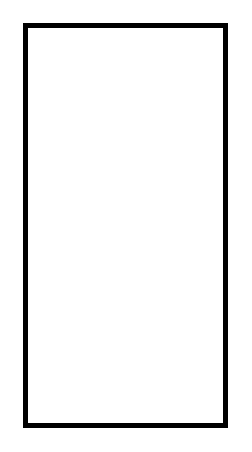

# Publish Subscribe Channel

## Definition

```
{
  _style: { 
    entity: 'strokeWidth=2;dashed=0;align=center;fontSize=8;html=1;shape=rect;',
  },
  _original_width: 80,
  _original_height: 160,
}
```

## Usage

```
import { PublishSubscribeChannel } from '@diac/standard-components-diagrams/eipMessagingChannels'

<PublishSubscribeChannel/>
```

## Preview


