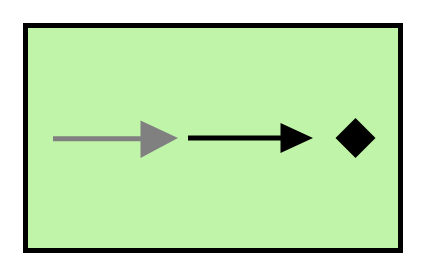

# Event Driven Consumer

## Definition

```
{
  _style: 'fillColor=#c0f5a9;dashed=0;outlineConnect=0;strokeWidth=2;html=1;align=center;fontSize=8;verticalLabelPosition=bottom;verticalAlign=top;shape=mxgraph.eip.event_driven_consumer;',
  _width: 150,
  _height: 90,
}
```

## Usage

```
import { EventDrivenConsumer } from '@reactiac/standard-components-diagrams/eipMessagingEndpoints'

<EventDrivenConsumer/>
```

## Preview


