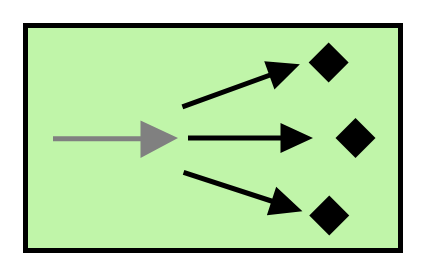
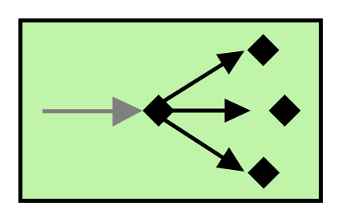
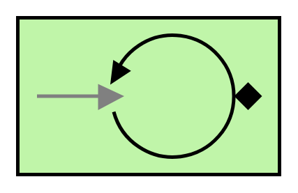
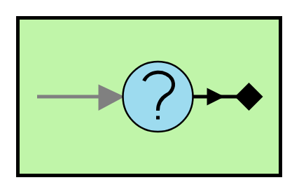

# Eip Messaging Endpoints Entities

- [CompetingConsumers](./competing-consumers.md)  

- [DurableSubscriber](./durable-subscriber.md)  

- [EventDrivenConsumer](./event-driven-consumer.md)  

- [MessageDispatcher](./message-dispatcher.md)  

- [MessagingGateway](./messaging-gateway.md)  

- [PollingConsumer](./polling-consumer.md)  

- [SelectiveConsumer](./selective-consumer.md)  

- [ServiceActivator](./service-activator.md)  

- [TransactionalClient](./transactional-client.md)  

