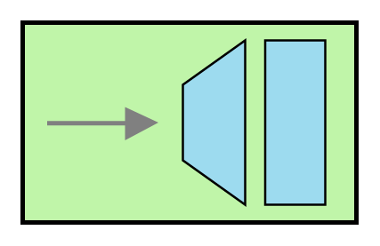

# Messaging Gateway

## Definition

```
{
  _style: { 
    entity: 'fillColor=#c0f5a9;dashed=0;outlineConnect=0;strokeWidth=2;html=1;align=center;fontSize=8;verticalLabelPosition=bottom;verticalAlign=top;shape=mxgraph.eip.messaging_gateway;',
  },
  _original_width: 150,
  _original_height: 90,
}
```

## Usage

```
import { MessagingGateway } from '@diac/standard-components-diagrams/eipMessagingEndpoints'

<MessagingGateway/>
```

## Preview


