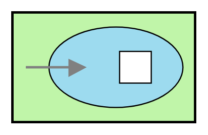

# Transactional Client

## Definition

```
{
  _style: { 
    entity: 'fillColor=#c0f5a9;dashed=0;outlineConnect=0;strokeWidth=2;html=1;align=center;fontSize=8;verticalLabelPosition=bottom;verticalAlign=top;shape=mxgraph.eip.transactional_client;',
  },
  _original_width: 150,
  _original_height: 90,
}
```

## Usage

```
import { TransactionalClient } from '@dinghy/standard-components-diagrams/eipMessagingEndpoints'

<TransactionalClient/>
```

## Preview


