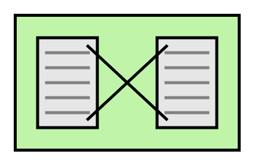

# Eip Messaging Systems Entities

- [Message](./message.md)  

- [Message2](./message-2.md)  

- [Message3](./message-3.md)  

- [Message4](./message-4.md)  

- [Message5](./message-5.md)  

- [Message6](./message-6.md)  

- [Message7](./message-7.md)  

- [Message8](./message-8.md)  

- [MessageChannel](./message-channel.md)  

- [MessageEndpoint](./message-endpoint.md)  

- [MessageEndpoint2](./message-endpoint-2.md)  

- [MessageEndpoint3](./message-endpoint-3.md)  

- [MessageEndpoint4](./message-endpoint-4.md)  

- [MessageRouter](./message-router.md)  

- [MessageTranslator](./message-translator.md)  

