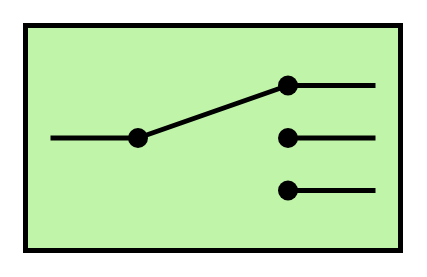

# Message Router

## Definition

```
{
  _style: { 
    entity: 'html=1;strokeWidth=2;outlineConnect=0;dashed=0;align=center;fontSize=8;shape=mxgraph.eip.content_based_router;verticalLabelPosition=bottom;verticalAlign=top;fillColor=#c0f5a9;',
  },
  _width: 150,
  _height: 90,
}
```

## Usage

```
import { MessageRouter } from '@diac/standard-components-diagrams/eipMessagingSystems'

<MessageRouter/>
```

## Preview


