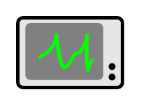

# Eip System Management Entities

- [ChannelPurger](./channel-purger.md)  

- [ControlBus](./control-bus.md)  

- [Detour](./detour.md)  

- [MessageStore](./message-store.md)  

- [SmartProxy](./smart-proxy.md)  

- [TestMessage](./test-message.md)  

- [WireTap](./wire-tap.md)  

