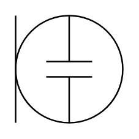

# Electret Microphone

## Definition

```
{
  _style: { 
    entity: 'verticalLabelPosition=bottom;shadow=0;dashed=0;align=center;html=1;verticalAlign=top;shape=mxgraph.electrical.radio.electret_microphone;',
  },
  _original_width: 70,
  _original_height: 70,
}
```

## Usage

```
import { ElectretMicrophone } from '@diac/standard-components-diagrams/electricalAudio'

<ElectretMicrophone/>
```

## Preview


