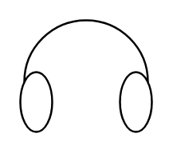

# Headphones

## Definition

```
{
  _style: 'verticalLabelPosition=bottom;shadow=0;dashed=0;align=center;html=1;verticalAlign=top;shape=mxgraph.electrical.radio.headphones;pointerEvents=1;',
  _width: 66,
  _height: 56,
}
```

## Usage

```
import { Headphones } from '@reactiac/standard-components-diagrams/electricalAudio'

<Headphones/>
```

## Preview


