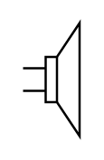

# Loudspeaker

## Definition

```
{
  _style: { 
    entity: 'pointerEvents=1;verticalLabelPosition=bottom;shadow=0;dashed=0;align=center;html=1;verticalAlign=top;shape=mxgraph.electrical.electro-mechanical.loudspeaker;',
  },
  _width: 25,
  _height: 50,
}
```

## Usage

```
import { Loudspeaker } from '@diac/standard-components-diagrams/electricalAudio'

<Loudspeaker/>
```

## Preview


