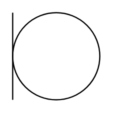

# Microphone

## Definition

```
{
  _style: { 
    entity: 'verticalLabelPosition=bottom;shadow=0;dashed=0;align=center;html=1;verticalAlign=top;shape=mxgraph.electrical.radio.microphone_1;',
  },
  _width: 60,
  _height: 60,
}
```

## Usage

```
import { Microphone } from '@diac/standard-components-diagrams/electricalAudio'

<Microphone/>
```

## Preview


