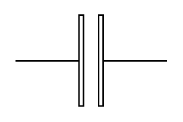

# Capacitor (UK)

## Definition

```
{
  _style: 'pointerEvents=1;verticalLabelPosition=bottom;shadow=0;dashed=0;align=center;html=1;verticalAlign=top;shape=mxgraph.electrical.capacitors.capacitor_4;',
  _width: 100,
  _height: 60,
}
```

## Usage

```
import { CapacitorUk } from '@diac/standard-components-diagrams/electricalCapacitors'

<CapacitorUk/>
```

## Preview


