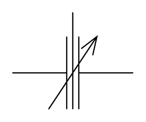

# Differential Capacitor

## Definition

```
{
  _style: 'pointerEvents=1;verticalLabelPosition=bottom;shadow=0;dashed=0;align=center;html=1;verticalAlign=top;shape=mxgraph.electrical.capacitors.differential_capacitor;',
  _width: 100,
  _height: 80,
}
```

## Usage

```
import { DifferentialCapacitor } from '@diac/standard-components-diagrams/electricalCapacitors'

<DifferentialCapacitor/>
```

## Preview


