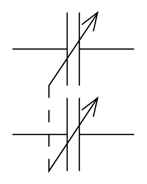

# Ganged Capacitor

## Definition

```
{
  _style: 'pointerEvents=1;verticalLabelPosition=bottom;shadow=0;dashed=0;align=center;html=1;verticalAlign=top;shape=mxgraph.electrical.capacitors.ganged_capacitor;',
  _width: 100,
  _height: 130,
}
```

## Usage

```
import { GangedCapacitor } from '@diac/standard-components-diagrams/electricalCapacitors'

<GangedCapacitor/>
```

## Preview


