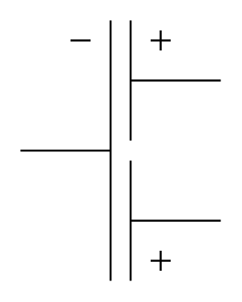

# Multiple Electrolytic Capacitor (Common Negative)

## Definition

```
{
  _style: { 
    entity: 'pointerEvents=1;verticalLabelPosition=bottom;shadow=0;dashed=0;align=center;html=1;verticalAlign=top;shape=mxgraph.electrical.capacitors.multiple_electrolytic_capacitor_comm_neg;',
  },
  _original_width: 100,
  _original_height: 130,
}
```

## Usage

```
import { MultipleElectrolyticCapacitorCommonNegative } from '@diac/standard-components-diagrams/electricalCapacitors'

<MultipleElectrolyticCapacitorCommonNegative/>
```

## Preview


