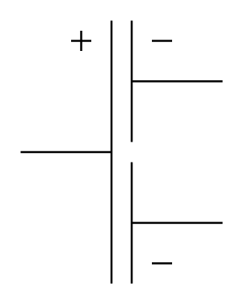

# Multiple Electrolytic Capacitor (Common Positive)

## Definition

```
{
  _style: 'pointerEvents=1;verticalLabelPosition=bottom;shadow=0;dashed=0;align=center;html=1;verticalAlign=top;shape=mxgraph.electrical.capacitors.multiple_electrolytic_capacitor_comm_pos;',
  _width: 100,
  _height: 130,
}
```

## Usage

```
import { MultipleElectrolyticCapacitorCommonPositive } from '@reactiac/standard-components-diagrams/electricalCapacitors'

<MultipleElectrolyticCapacitorCommonPositive/>
```

## Preview


