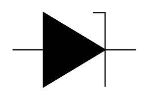

# Breakdown

## Definition

```
{
  _style: { 
    entity: 'pointerEvents=1;fillColor=strokeColor;verticalLabelPosition=bottom;shadow=0;dashed=0;align=center;html=1;verticalAlign=top;shape=mxgraph.electrical.diodes.zener_diode_2;',
  },
  _original_width: 100,
  _original_height: 60,
}
```

## Usage

```
import { Breakdown } from '@diac/standard-components-diagrams/electricalDiodes'

<Breakdown/>
```

## Preview


