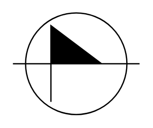

# Four Layer Diode

## Definition

```
{
  _style: 'pointerEvents=1;fillColor=strokeColor;verticalLabelPosition=bottom;shadow=0;dashed=0;align=center;html=1;verticalAlign=top;shape=mxgraph.electrical.diodes.four_layer_diode;',
  _width: 100,
  _height: 80,
}
```

## Usage

```
import { FourLayerDiode } from '@reactiac/standard-components-diagrams/electricalDiodes'

<FourLayerDiode/>
```

## Preview


