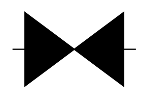

# Gunn Diode

## Definition

```
{
  _style: { 
    entity: 'pointerEvents=1;fillColor=strokeColor;verticalLabelPosition=bottom;shadow=0;dashed=0;align=center;html=1;verticalAlign=top;shape=mxgraph.electrical.diodes.gunn_diode;',
  },
  _width: 100,
  _height: 60,
}
```

## Usage

```
import { GunnDiode } from '@diac/standard-components-diagrams/electricalDiodes'

<GunnDiode/>
```

## Preview


