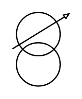

# Adjustable Transformer

## Definition

```
{
  _style: 'pointerEvents=1;verticalLabelPosition=bottom;shadow=0;dashed=0;align=center;html=1;verticalAlign=top;shape=mxgraph.electrical.inductors.adjustable_transformer;',
  _width: 46,
  _height: 60,
}
```

## Usage

```
import { AdjustableTransformer } from '@diac/standard-components-diagrams/electricalInductors'

<AdjustableTransformer/>
```

## Preview


