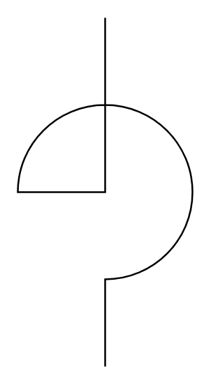

# Choke

## Definition

```
{
  _style: 'pointerEvents=1;verticalLabelPosition=bottom;shadow=0;dashed=0;align=center;html=1;verticalAlign=top;shape=mxgraph.electrical.inductors.choke;',
  _width: 100,
  _height: 200,
}
```

## Usage

```
import { Choke } from '@reactiac/standard-components-diagrams/electricalInductors'

<Choke/>
```

## Preview


