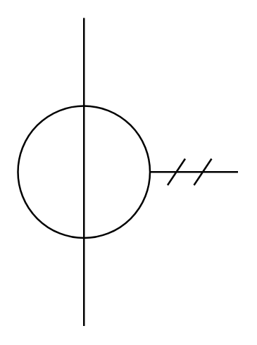

# Current Transformer 2

## Definition

```
{
  _style: { 
    entity: 'pointerEvents=1;verticalLabelPosition=bottom;shadow=0;dashed=0;align=center;html=1;verticalAlign=top;shape=mxgraph.electrical.inductors.current_transformer_2;',
  },
  _width: 125,
  _height: 175,
}
```

## Usage

```
import { CurrentTransformer2 } from '@diac/standard-components-diagrams/electricalInductors'

<CurrentTransformer2/>
```

## Preview


