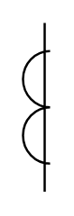

# Current Transformer

## Definition

```
{
  _style: { 
    entity: 'pointerEvents=1;verticalLabelPosition=bottom;shadow=0;dashed=0;align=center;html=1;verticalAlign=top;shape=mxgraph.electrical.inductors.current_transformer_1;',
  },
  _original_width: 12,
  _original_height: 75,
}
```

## Usage

```
import { CurrentTransformer } from '@diac/standard-components-diagrams/electricalInductors'

<CurrentTransformer/>
```

## Preview


