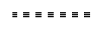

# Ferrite Core

## Definition

```
{
  _style: 'pointerEvents=1;verticalLabelPosition=bottom;shadow=0;dashed=0;align=center;html=1;verticalAlign=top;shape=mxgraph.electrical.inductors.ferrite_core;',
  _width: 64,
  _height: 4,
}
```

## Usage

```
import { FerriteCore } from '@reactiac/standard-components-diagrams/electricalInductors'

<FerriteCore/>
```

## Preview


