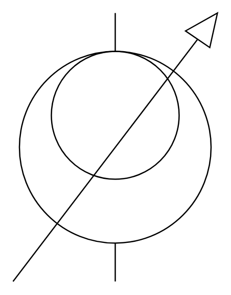

# Induction Voltage Regulator

## Definition

```
{
  _style: { 
    entity: 'pointerEvents=1;verticalLabelPosition=bottom;shadow=0;dashed=0;align=center;html=1;verticalAlign=top;shape=mxgraph.electrical.inductors.induction_voltage_regulator;',
  },
  _original_width: 160,
  _original_height: 210,
}
```

## Usage

```
import { InductionVoltageRegulator } from '@dinghy/standard-components-diagrams/electricalInductors'

<InductionVoltageRegulator/>
```

## Preview


