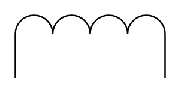

# Inductor

## Definition

```
{
  _style: { 
    entity: 'pointerEvents=1;verticalLabelPosition=bottom;shadow=0;dashed=0;align=center;html=1;verticalAlign=top;shape=mxgraph.electrical.inductors.inductor;',
  },
  _original_width: 100,
  _original_height: 42,
}
```

## Usage

```
import { Inductor } from '@diac/standard-components-diagrams/electricalInductors'

<Inductor/>
```

## Preview


