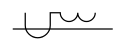

# Linear Coupler

## Definition

```
{
  _style: 'pointerEvents=1;verticalLabelPosition=bottom;shadow=0;dashed=0;align=center;html=1;verticalAlign=top;shape=mxgraph.electrical.inductors.linear_coupler;',
  _width: 80,
  _height: 20,
}
```

## Usage

```
import { LinearCoupler } from '@diac/standard-components-diagrams/electricalInductors'

<LinearCoupler/>
```

## Preview


