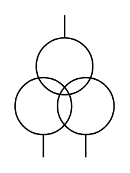

# Pot. Trans. 3 Windings

## Definition

```
{
  _style: 'pointerEvents=1;verticalLabelPosition=bottom;shadow=0;dashed=0;align=center;html=1;verticalAlign=top;shape=mxgraph.electrical.inductors.pot_trans_3_windings;',
  _width: 67,
  _height: 96,
}
```

## Usage

```
import { PotTrans3Windings } from '@diac/standard-components-diagrams/electricalInductors'

<PotTrans3Windings/>
```

## Preview


