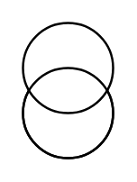

# Transformer 2

## Definition

```
{
  _style: { 
    entity: 'verticalLabelPosition=bottom;shadow=0;dashed=0;align=center;html=1;verticalAlign=top;strokeWidth=1;shape=mxgraph.electrical.signal_sources.current_source;',
  },
  _original_width: 40,
  _original_height: 60,
}
```

## Usage

```
import { Transformer2 } from '@diac/standard-components-diagrams/electricalInductors'

<Transformer2/>
```

## Preview


