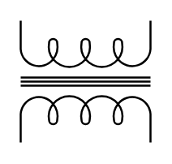

# Transformer (Iron Core) 2

## Definition

```
{
  _style: { 
    entity: 'pointerEvents=1;verticalLabelPosition=bottom;shadow=0;dashed=0;align=center;html=1;verticalAlign=top;shape=mxgraph.electrical.inductors.transformer_2;',
  },
  _original_width: 64,
  _original_height: 60,
}
```

## Usage

```
import { TransformerIronCore2 } from '@diac/standard-components-diagrams/electricalInductors'

<TransformerIronCore2/>
```

## Preview


