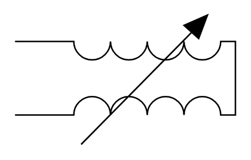

# Variometer

## Definition

```
{
  _style: { 
    entity: 'verticalLabelPosition=top;shadow=0;dashed=0;align=center;fillColor=strokeColor;html=1;verticalAlign=bottom;strokeWidth=1;shape=mxgraph.electrical.inductors.variometer;',
  },
  _original_width: 150,
  _original_height: 88,
}
```

## Usage

```
import { Variometer } from '@dinghy/standard-components-diagrams/electricalInductors'

<Variometer/>
```

## Preview


