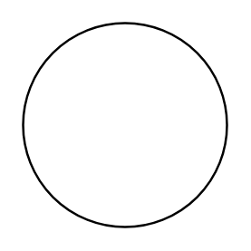

# Ammeter

## Definition

```
{
  _style: 'verticalLabelPosition=middle;shadow=0;dashed=0;align=center;html=1;verticalAlign=middle;strokeWidth=1;shape=ellipse;aspect=fixed;fontSize=50;',
  _width: 90,
  _height: 90,
}
```

## Usage

```
import { Ammeter } from '@reactiac/standard-components-diagrams/electricalInstruments'

<Ammeter/>
```

## Preview


