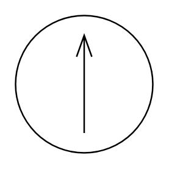

# Galvanometer

## Definition

```
{
  _style: 'perimeter=ellipsePerimeter;verticalLabelPosition=bottom;shadow=0;dashed=0;align=center;html=1;verticalAlign=top;shape=mxgraph.electrical.instruments.galvanometer;',
  _width: 90,
  _height: 90,
}
```

## Usage

```
import { Galvanometer } from '@reactiac/standard-components-diagrams/electricalInstruments'

<Galvanometer/>
```

## Preview


