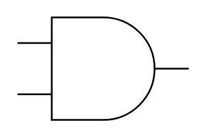

# AND

## Definition

```
{
  _style: { 
    entity: 'verticalLabelPosition=bottom;shadow=0;dashed=0;align=center;html=1;verticalAlign=top;shape=mxgraph.electrical.logic_gates.logic_gate;operation=and;',
  },
  _width: 100,
  _height: 60,
}
```

## Usage

```
import { And } from '@diac/standard-components-diagrams/electricalLogicGates'

<And/>
```

## Preview


