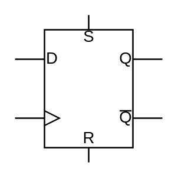

# D Type RS Flip-Flop

## Definition

```
{
  _style: 'verticalLabelPosition=bottom;shadow=0;dashed=0;align=center;html=1;verticalAlign=top;shape=mxgraph.electrical.logic_gates.d_type_rs_flip-flop;',
  _width: 100,
  _height: 100,
}
```

## Usage

```
import { DTypeRsFlipFlop } from '@reactiac/standard-components-diagrams/electricalLogicGates'

<DTypeRsFlipFlop/>
```

## Preview


