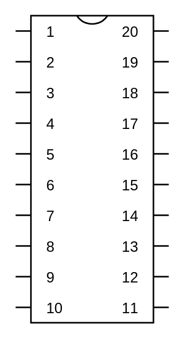

# Dual In-Line IC

## Definition

```
{
  _style: { 
    entity: 'shadow=0;dashed=0;align=center;html=1;strokeWidth=1;shape=mxgraph.electrical.logic_gates.dual_inline_ic;labelNames=a,b,c,d,e,f,g,h,i,j,k,l,m,n,o,p,q,r,s,t;whiteSpace=wrap;',
  },
  _original_width: 100,
  _original_height: 200,
}
```

## Usage

```
import { DualInLineIc } from '@diac/standard-components-diagrams/electricalLogicGates'

<DualInLineIc/>
```

## Preview


