# Electrical Logic Gates Entities

- [And](./and.md)  

- [AndIec](./and-iec.md)  
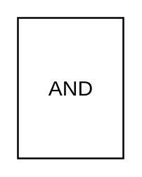

- [Buffer](./buffer.md)  
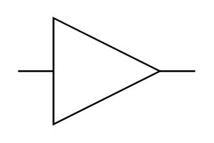

- [DTypeFlipFlop](./d-type-flip-flop.md)  

- [DTypeFlipFlopWithClear](./d-type-flip-flop-with-clear.md)  

- [DTypeRsFlipFlop](./d-type-rs-flip-flop.md)  

- [DualInLineIc](./dual-in-line-ic.md)  

- [Inverter](./inverter.md)  

- [InvertingContact](./inverting-contact.md)  
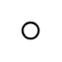

- [JkFlipFlop](./jk-flip-flop.md)  

- [JkFlipFlopWithClear](./jk-flip-flop-with-clear.md)  
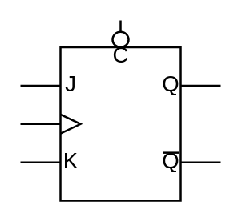

- [JkFlipFlopWithSr](./jk-flip-flop-with-sr.md)  
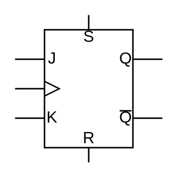

- [Nand](./nand.md)  
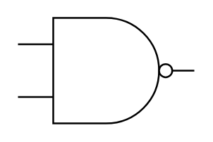

- [NandIec](./nand-iec.md)  
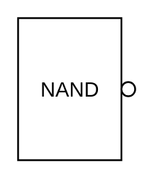

- [Nor](./nor.md)  
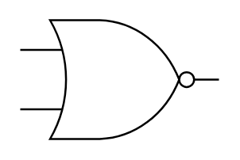

- [NorIec](./nor-iec.md)  
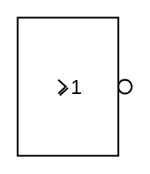

- [NotIec](./not-iec.md)  
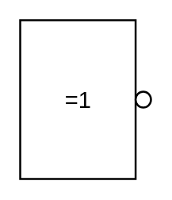

- [Or](./or.md)  
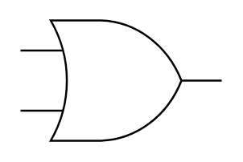

- [OrIec](./or-iec.md)  

- [QuadFlatPackageIc](./quad-flat-package-ic.md)  

- [RsLatch](./rs-latch.md)  

- [RsLatchSynchronous](./rs-latch-synchronous.md)  
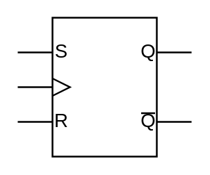

- [SchmittTrigger](./schmitt-trigger.md)  
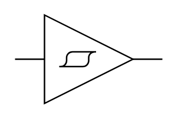

- [TTypeFlipFlop](./t-type-flip-flop.md)  
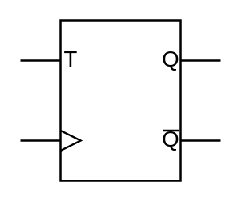

- [Xnor](./xnor.md)  
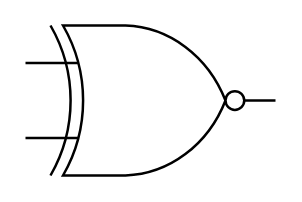

- [Xor](./xor.md)  

- [XorIec](./xor-iec.md)  
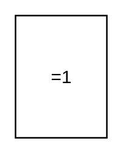
