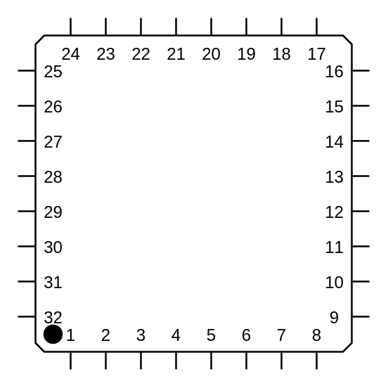

# Quad Flat Package IC

## Definition

```
{
  _style: 'shadow=0;dashed=0;align=center;html=1;strokeWidth=1;shape=mxgraph.electrical.logic_gates.qfp_ic;whiteSpace=wrap;labelNames=a,b,c,d,e,f,g,h,i,j,k,l,m,n,o,p,q,r,s,t,u,v,w,x,y,z,a1,b1,c1,d1,e1,f1,g1,h1,i1,j1,k1,l1,m1,n1;',
  _width: 200,
  _height: 200,
}
```

## Usage

```
import { QuadFlatPackageIc } from '@diac/standard-components-diagrams/electricalLogicGates'

<QuadFlatPackageIc/>
```

## Preview


