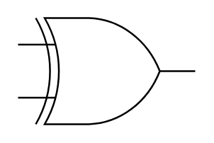

# XOR

## Definition

```
{
  _style: 'verticalLabelPosition=bottom;shadow=0;dashed=0;align=center;html=1;verticalAlign=top;shape=mxgraph.electrical.logic_gates.logic_gate;operation=xor;',
  _width: 100,
  _height: 60,
}
```

## Usage

```
import { Xor } from '@reactiac/standard-components-diagrams/electricalLogicGates'

<Xor/>
```

## Preview


