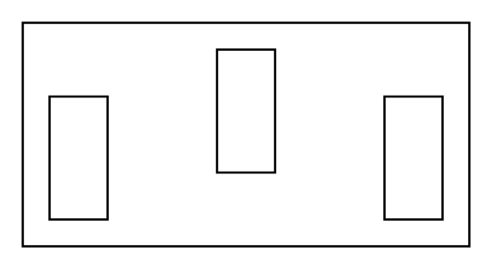

# AC Out

## Definition

```
{
  _style: 'pointerEvents=1;verticalLabelPosition=bottom;shadow=0;dashed=0;align=center;html=1;verticalAlign=top;shape=mxgraph.electrical.miscellaneous.ac_out',
  _width: 200,
  _height: 100,
}
```

## Usage

```
import { AcOut } from '@diac/standard-components-diagrams/electricalMisc'

<AcOut/>
```

## Preview


