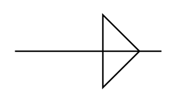

# Cable Termination

## Definition

```
{
  _style: { 
    entity: 'pointerEvents=1;verticalLabelPosition=bottom;shadow=0;dashed=0;align=center;html=1;verticalAlign=top;shape=mxgraph.electrical.miscellaneous.cable_termination',
  },
  _width: 100,
  _height: 50,
}
```

## Usage

```
import { CableTermination } from '@diac/standard-components-diagrams/electricalMisc'

<CableTermination/>
```

## Preview


