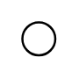

# Circuit Terminal

## Definition

```
{
  _style: 'verticalLabelPosition=bottom;shadow=0;dashed=0;align=center;html=1;verticalAlign=top;strokeWidth=1;shape=ellipse;perimeter=ellipsePerimeter;',
  _width: 15,
  _height: 15,
}
```

## Usage

```
import { CircuitTerminal } from '@diac/standard-components-diagrams/electricalMisc'

<CircuitTerminal/>
```

## Preview


