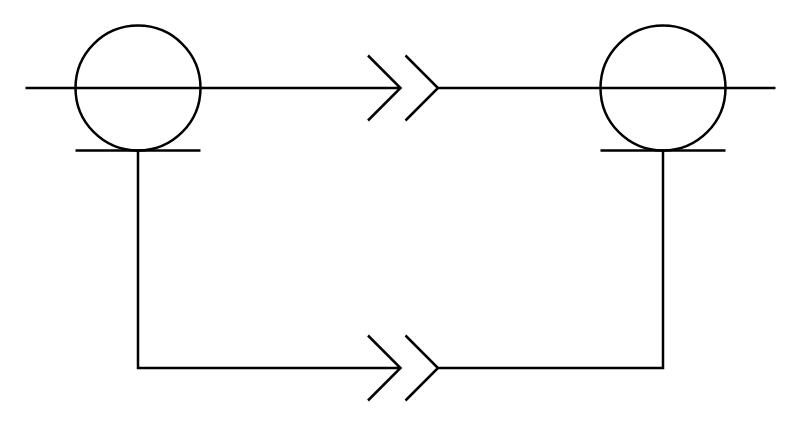

# Coaxial Outside Conductor

## Definition

```
{
  _style: 'pointerEvents=1;verticalLabelPosition=bottom;shadow=0;dashed=0;align=center;html=1;verticalAlign=top;shape=mxgraph.electrical.miscellaneous.coaxial_outside_conductor',
  _width: 300,
  _height: 150,
}
```

## Usage

```
import { CoaxialOutsideConductor } from '@reactiac/standard-components-diagrams/electricalMisc'

<CoaxialOutsideConductor/>
```

## Preview


