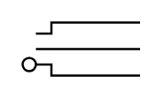

# 3 Conductor Plug

## Definition

```
{
  _style: { 
    entity: 'pointerEvents=1;verticalLabelPosition=bottom;shadow=0;dashed=0;align=center;html=1;verticalAlign=top;shape=mxgraph.electrical.miscellaneous.3_conductor_plug',
  },
  _original_width: 53,
  _original_height: 24,
}
```

## Usage

```
import { Component3ConductorPlug } from '@diac/standard-components-diagrams/electricalMisc'

<Component3ConductorPlug/>
```

## Preview


