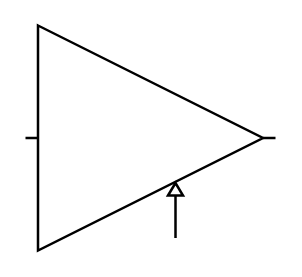

# Controlled Amplifier

## Definition

```
{
  _style: 'verticalLabelPosition=bottom;shadow=0;dashed=0;align=center;html=1;verticalAlign=top;shape=mxgraph.electrical.abstract.controlled_amplifier;',
  _width: 100,
  _height: 90,
}
```

## Usage

```
import { ControlledAmplifier } from '@reactiac/standard-components-diagrams/electricalMisc'

<ControlledAmplifier/>
```

## Preview


