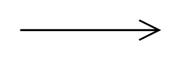

# Current Flow

## Definition

```
{
  _style: { 
    entity: 'verticalLabelPosition=top;verticalAlign=bottom;shape=mxgraph.electrical.signal_sources.current_flow;shadow=0;dashed=0;align=center;strokeWidth=1;fontSize=10;html=1;',
  },
  _width: 70,
  _height: 10,
}
```

## Usage

```
import { CurrentFlow } from '@diac/standard-components-diagrams/electricalMisc'

<CurrentFlow/>
```

## Preview


