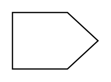

# DAC

## Definition

```
{
  _style: 'verticalLabelPosition=bottom;shadow=0;dashed=0;align=center;html=1;verticalAlign=top;shape=mxgraph.electrical.abstract.dac;',
  _width: 70,
  _height: 46,
}
```

## Usage

```
import { Dac } from '@reactiac/standard-components-diagrams/electricalMisc'

<Dac/>
```

## Preview


