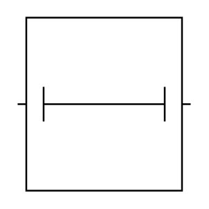

# Delay Element

## Definition

```
{
  _style: 'pointerEvents=1;verticalLabelPosition=bottom;shadow=0;dashed=0;align=center;html=1;verticalAlign=top;shape=mxgraph.electrical.miscellaneous.delay_element',
  _width: 60,
  _height: 60,
}
```

## Usage

```
import { DelayElement } from '@diac/standard-components-diagrams/electricalMisc'

<DelayElement/>
```

## Preview


