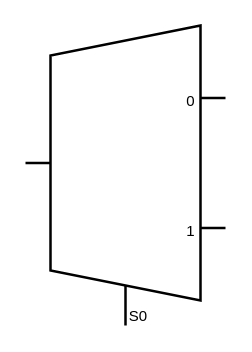

# Demux

## Definition

```
{
  _style: { 
    entity: 'shadow=0;dashed=0;align=center;html=1;strokeWidth=1;shape=mxgraph.electrical.abstract.mux2;operation=demux;whiteSpace=wrap;',
  },
  _width: 80,
  _height: 120,
}
```

## Usage

```
import { Demux } from '@diac/standard-components-diagrams/electricalMisc'

<Demux/>
```

## Preview


